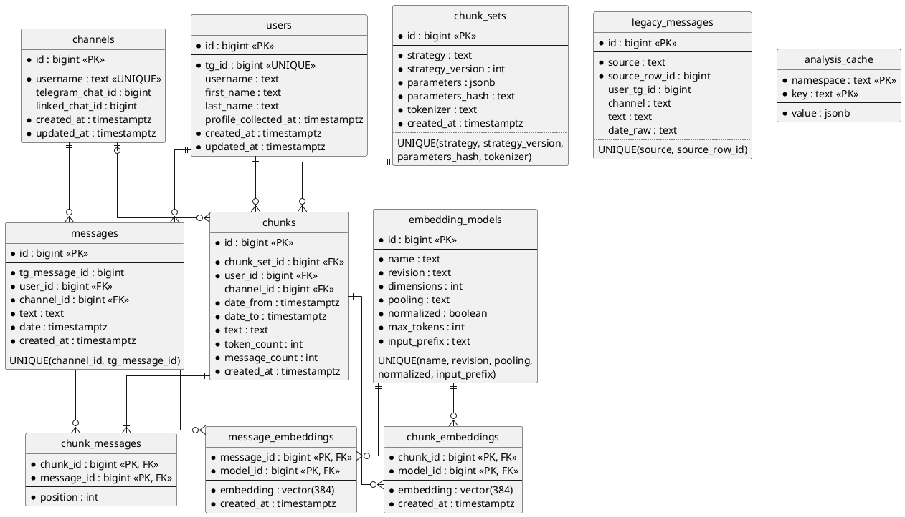
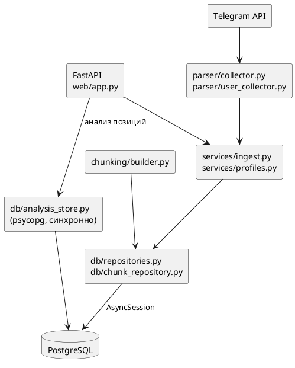

# Перевод хранения с SQLite на PostgreSQL

Статус на 2026-10-08: приложение работает на PostgreSQL, SQLite в работе не
участвует. Таблицы эмбеддингов созданы после выбора модели, обоснование — в
[embedding-chunking-research.md](embedding-chunking-research.md).

## Зачем

Причина перехода не в скорости. Нужны были:

- одна база вместо общей `app.db` и отдельного файла на каждого пользователя;
- запись из нескольких задач одновременно;
- нормальные связи между пользователями, каналами и комментариями;
- pgvector для эмбеддингов и хранение чанков рядом с исходными сообщениями;
- миграции схемы через Alembic вместо `CREATE TABLE IF NOT EXISTS` в коде.

## Старая схема

`data/app.db`, режим `collect`:

| Таблица | Поля |
|---|---|
| `users` | `tg_id` PK, `username` |
| `channels` | `name` PK |
| `messages` | `id`, `user`, `channel`, `text`, `date` |

`data/<имя>_<tg_id>.db`, режим `user-comments`, по файлу на пользователя:

| Таблица | Поля |
|---|---|
| `user_messages` | `id`, `tg_id`, `username`, `channel`, `message_id`, `text`, `date`, `UNIQUE(channel, message_id)` |

Что в ней мешало:

- В `app.db.messages` не было идентификатора сообщения Telegram и не было
  ограничения уникальности. `INSERT OR IGNORE` там ничего не отсекал, повторный
  `collect` копил дубликаты.
- Текст сохранялся после `NFKC` и приведения к нижнему регистру, оригинал терялся.
- Дата хранилась строкой без пояса, в локальном времени процесса.
- Пользователь в веб-интерфейсе адресовался именем файла.
- SQLite допускает одного писателя, поэтому `collect` писал через очередь и
  единственную задачу записи.

## Новая схема



Пояснения к решениям:

- **Идентичность комментария** — пара `(channel_id, tg_message_id)`.
  `tg_message_id` это номер сообщения в чате обсуждения, а не в самом канале. У
  канала один чат обсуждения, поэтому пара однозначна; идентификатор чата хранится
  в `channels.linked_chat_id`. Поле обязательное, исключений для старых данных нет.
- **`users.tg_id`** — устойчивый идентификатор. Ник может смениться или исчезнуть,
  он только отображается.
- **`users.profile_collected_at`** отмечает пользователей, по которым запускали
  `user-comments`. Список профилей показывает только их. Без этого поля в списке
  оказались бы все авторы, встреченные при `collect` (сейчас их 9 858).
- **Текст** хранится таким, каким пришёл из Telegram. Исходное сообщение не
  меняется; чанки и эмбеддинги из него выводятся.
- **Дата** хранится как `timestamptz`. Pyrogram отдаёт наивное локальное время,
  оно переводится в UTC на входе (`parser/telegram.py::_utc`).
- **`legacy_messages`** — архив строк `app.db.messages`. У них нет идентификатора
  Telegram, поэтому в `messages` они не попали. Приложение эту таблицу не читает.
  Склеивать их с настоящими сообщениями по совпадению автора, канала, даты и
  текста нельзя: два разных сообщения могут совпасть по всем четырём.
- **`analysis_cache`** — контрольные точки и кеш анализа позиций. Данные
  производные: таблицу можно очистить, анализ пересчитается.
- **Чанки** связаны с сообщениями отношением «многие ко многим»: при перекрытии
  одно сообщение входит в несколько чанков. `position` восстанавливает порядок.
  `chunk_sets` описывает способ нарезки, так что результаты разных экспериментов
  лежат рядом.

### Эмбеддинги

- `embedding_models` описывает, чем получен вектор: имя модели, ревизия,
  размерность, способ объединения токенов, нормализация, предел входа, префикс.
  Ревизия обязательна — это коммит репозитория модели. Будь она необязательной,
  уникальность по этим полям пропускала бы одну и ту же модель дважды: два
  `NULL` в PostgreSQL не равны.
- `message_embeddings` и `chunk_embeddings` — две отдельные таблицы, а не одна с
  двумя необязательными внешними ключами: у каждого вектора обязательно есть
  владелец. Ключ `(владелец, model_id)` не даёт построить один и тот же вектор
  дважды и позволяет хранить векторы нескольких моделей и ревизий рядом.
- Вектор чанка удаляется вместе с чанком; сообщения не удаляются никогда.
- Столбец `vector(384)`: размерность выбранной модели
  `intfloat/multilingual-e5-small`. Модель другой размерности потребует своей
  миграции со своими таблицами.
- Модели таблиц лежат в `db/embedding_models.py`, отдельно от остальных: тип
  pgvector тянет NumPy, без которого веб-приложение обязано запускаться.

## Индексы

| Индекс | Какому запросу нужен |
|---|---|
| `users(tg_id)` UNIQUE | поиск пользователя по адресу `/users/{tg_id}`, upsert |
| `channels(username)` UNIQUE | upsert канала |
| `messages(channel_id, tg_message_id)` UNIQUE | защита от дубликатов, `ON CONFLICT` |
| `messages(user_id, date)` | комментарии пользователя по времени, активность, последние N |
| `messages(user_id, channel_id)` | распределение по каналам |
| `chunks(chunk_set_id, user_id)` | чанки пользователя в наборе, пересборка |
| `chunk_messages(chunk_id, message_id)` PK | состав чанка |
| `chunk_messages(message_id)` | в какие чанки входит сообщение |
| `analysis_cache(namespace, key)` PK | чтение кеша по ключам |
| `message_embeddings(message_id, model_id)` PK | какие сообщения ещё без вектора модели |
| `chunk_embeddings(chunk_id, model_id)` PK | какие чанки ещё без вектора модели |

Отдельных индексов `messages(channel_id)` и `messages(date)` нет: запросов только
по каналу или только по дате у приложения нет, а первый столбец уникального
индекса уже покрывает канал.

Векторного индекса нет намеренно. Поиск идёт среди векторов одного пользователя,
точный перебор на рабочих таблицах занимает 20 мс по медиане и 57 мс в 95-м
процентиле, а индекс HNSW с фильтром по пользователю в замерах возвращал 60–70 %
верных ближайших и почти удваивал объём. Замеры — в отчётах об эмбеддингах.

## Слои



Весь SQL находится в `db/`. Обработчики FastAPI и сборщики запросов не содержат.

`db/analysis_store.py` — единственное место с синхронным драйвером. Анализ
позиций вызывает хранилище из рабочих потоков, поэтому переписывать его на
`AsyncSession` в рамках этого перехода не стали.

## Транзакции и одновременная запись

- Один вызов сервиса — одна транзакция. Транзакцией владеет вызывающий
  (`async with sessions.begin()`), репозиторий её не открывает.
- **`collect`**: до восьми каналов читаются одновременно. Каждый копит пакет из
  500 сообщений и пишет его своей транзакцией: upsert авторов, затем вставка
  сообщений с `ON CONFLICT DO NOTHING`. Очереди с одним писателем больше нет.
- **`user-comments`**: каналы идут по одному, комментарии канала пишутся одной
  транзакцией.
- Строки в пакете сортируются по ключу, чтобы параллельные пакеты брали блокировки
  в одном порядке и не уходили во взаимную блокировку.
- **Ошибка одного канала** записывается в журнал, канал пропускается. Уже
  сохранённые пакеты этого и других каналов остаются. **Отказ сессии Telegram**
  (`Unauthorized`, `AuthKeyDuplicated`) прерывает сбор.
- Повторный запуск ничего не дублирует: `user-comments` печатает, сколько
  сообщений получено, сколько новых и сколько уже было.
- Анализ позиций выполняется в одном экземпляре на все процессы: блокировка
  `pg_try_advisory_lock` на время работы.

Сравнение двух способов записи на 110 585 комментариях:

| Способ | Время, с | Строк в секунду |
|---|---|---|
| пакеты по 500, один писатель | 12,7 | 8 680 |
| пакеты по 500, восемь писателей | 10,0 | 11 063 |

Выигрыш около 27 %: запись упирается в подготовку параметров на стороне клиента,
а не в базу. При сборе из Telegram скорость определяют ожидания API, а не
вставка. Одновременная запись выбрана ради простоты и изоляции ошибок по каналам.

## Перенос данных из SQLite

```
docker compose up -d postgres
./scripts/run.sh migrate
python -m scripts.import_sqlite --data-dir data
```

Импортёр открывает SQLite только на чтение и его можно запускать повторно.

- Из `app.db` берутся пользователи и каналы. Его сообщения уходят в `legacy_messages`.
- Из файлов пользователей берутся комментарии. Имя файла даёт `tg_id`, а для
  пользователя без ника — отображаемое имя.
- Ник, уже записанный в PostgreSQL, не затирается.
- Наивные даты читаются в поясе `--source-timezone`, по умолчанию UTC.
- Строки без идентификатора сообщения, канала, текста или с нечитаемой датой
  считаются и пропускаются. Нечитаемый файл не останавливает остальные, код
  возврата тогда 1.

Результат на реальных данных:

| | Просмотрено | Добавлено |
|---|---|---|
| пользователи | 2 450 | 2 450 |
| каналы | 141 | 141 |
| комментарии | 28 814 | 28 814 |
| дубликаты | | 0 |
| отброшенные строки | | 0 |
| строки `app.db` без идентификатора | 25 023 | 25 023 в архив |

Проверки:

- Все 28 814 комментариев сверены с SQLite построчно по автору, каналу, номеру,
  тексту и дате: расхождений нет.
- Повторный запуск не добавил ни одной строки.
- **Пояс дат.** 40 сохранённых сообщений (по три из каждого непустого файла:
  самое старое, самое новое, последнее записанное) запрошены из Telegram заново.
  39 совпали с настоящим временем секунда в секунду как UTC, одно сообщение
  удалено. Выборка по три строки на файл: файл, который писали из разных поясов,
  она могла не поймать.

### После переноса

Старые файлы пользователей были неполными: при сборе часть каналов отваливалась
по ограничению частоты запросов. Кроме того, перенесённый текст остался в нижнем
регистре. Поэтому после переноса выполнены:

| Запуск | Каналов | Сбоев | Результат |
|---|---|---|---|
| `python -m scripts.refresh_texts` | 143 | 0 | получено 39 070, новых 15 490, текст восстановлен |
| `collect` с `LIMIT=1000` | 143 | 0 | новых 65 996 за 628 с |

`refresh_texts` обходит каналы один раз и в каждом запрашивает комментарии всех
профилей: один поиск канала на канал, а не на канал и профиль.

Итог: 110 585 комментариев 9 858 авторов, 11 382 пользователя, из них 16
профилей, 141 канал. Повторов по `(channel_id, tg_message_id)` нет. Комментарии,
удалённые из Telegram до обновления, остались в нижнем регистре.

## Docker

`docker-compose.yml`:

| Сервис | Назначение |
|---|---|
| `postgres` | `pgvector/pgvector:0.8.6-pg18-bookworm`, том `postgres-data`, проверка `pg_isready`, порт `127.0.0.1:5435` |
| `postgres-test` | та же сборка, данные в памяти, порт `127.0.0.1:5436`, профиль `test` |
| `app` | режимы командной строки, профиль `cli` |
| `web` | веб-интерфейс |

`app` и `web` запускаются после того, как `postgres` прошёл проверку. Внутри
сети compose они получают `DATABASE_URL` с хостом `postgres`; для запуска с хоста
в `.env` указывается `127.0.0.1:5435`.

```
./scripts/run.sh migrate
./scripts/run.sh user-comments @username
./scripts/run.sh web
```

## Alembic

| Ревизия | Что создаёт |
|---|---|
| `0001` | расширение `vector`, `users`, `channels`, `messages`, `legacy_messages` |
| `0002` | `analysis_cache` |
| `0003` | `chunk_sets`, `chunks`, `chunk_messages` |
| `0004` | `embedding_models`, `message_embeddings`, `chunk_embeddings` с `vector(768)` |
| `0005` | столбцы эмбеддингов `vector(768)` → `vector(384)` под `multilingual-e5-small`; имевшиеся векторы удаляются |

`alembic/env.py` берёт тот же `DATABASE_URL`, что и приложение, и работает через
асинхронный драйвер: второй адрес не нужен.

```
alembic upgrade head      # применить
alembic current           # текущая ревизия
alembic check             # модели и база совпадают
```

## pgvector

Расширение включается первой миграцией: `CREATE EXTENSION IF NOT EXISTS vector`.
Образ с закреплённой версией pgvector 0.8.6 на PostgreSQL 18. Столбцы эмбеддингов
появляются в миграции `0004` и получают окончательный размер `vector(384)` в `0005`. Используется оператор косинусного расстояния `<=>`:
на нормализованных векторах он даёт тот же порядок, что скалярное произведение и
евклидово расстояние, и остаётся верным для ненормализованных.

## Резервная копия

```
docker compose exec -T postgres \
    pg_dump -U telegram -d telegram_comments -Fc > telegram_comments.dump
```

Восстановление в пустую базу:

```
docker compose exec -T postgres \
    pg_restore -U telegram -d telegram_comments --clean --if-exists < telegram_comments.dump
```

Формат `-Fc` сжат и позволяет восстанавливать таблицы выборочно. Таблицы чанков,
эмбеддингов и `analysis_cache` можно не сохранять: они пересчитываются из
`messages`. Исключить их: `--exclude-table-data=analysis_cache` и так далее.

## Замеры

`python -m benchmarks.postgres_benchmark`, копия реальных комментариев (110 585) в
тестовой базе, PostgreSQL в Docker на той же машине. Замеры сняты, пока на машине
шёл расчёт эмбеддингов, так что числа скорее завышены.

| Запись | Строк | Время, с | Строк в секунду |
|---|---|---|---|
| одна транзакция | 1 000 | 0,12 | 8 576 |
| одна транзакция | 10 000 | 1,12 | 8 892 |
| одна транзакция | 110 585 | 11,92 | 9 274 |
| те же строки повторно, все дубликаты | 110 585 | 9,67 | 11 440 |

Запросы для пользователя с наибольшим числом комментариев (24 076), 30 повторов:

| Чтение | Строк | p50, мс | p95, мс |
|---|---|---|---|
| все комментарии пользователя | 24 076 | 103,0 | 175,3 |
| последние 50 | 50 | 0,8 | 1,4 |
| за последние 30 дней | 6 397 | 11,7 | 64,1 |
| распределение по каналам | 25 | 8,2 | 9,9 |
| активность по часам | 24 | 16,5 | 19,6 |
| активность по дням недели и часам | 155 | 27,0 | 29,1 |

Сравнение с SQLite не проводилось: цель перехода не скорость. Размер базы после
сбора — 64 МБ, из них `messages` 45 МБ.

## Проверка

- Интеграционные тесты `tests/postgres` идут на отдельной базе, имя которой
  обязано оканчиваться на `_test`: тесты удаляют в ней схему. Без
  `TEST_DATABASE_URL` они пропускаются, в CI поднимается сервис с pgvector.
- `alembic check` на тестовой и рабочей базе: расхождений между моделями и
  схемой нет.

## Состояние рабочей базы

После построения 2026-10-09 (`scripts.build_chunks`, затем `scripts.embed`):

| Таблица | Строк | Данные | Индексы | Всего |
|---|---|---|---|---|
| `messages` | 110 585 | 30 МБ | 14 МБ | 45 МБ |
| `chunks` | 24 489 | 24 МБ | 1 МБ | 25 МБ |
| `chunk_messages` | 110 585 | 5,7 МБ | 7,2 МБ | 13 МБ |
| `message_embeddings` | 110 585 | 173 МБ | 3,4 МБ | 176 МБ |
| `chunk_embeddings` | 24 489 | 38 МБ | 0,8 МБ | 39 МБ |

Вся база — 318 МБ. Чанки: `token_budget`, 256 токенов, внутри канала, без
перекрытия; каждое сообщение входит ровно в один чанк. Сообщений и чанков без
вектора нет, векторов без владельца нет.

Обновление текста сообщения из Telegram (`--refresh-text`, `scripts.refresh_texts`)
удаляет вектор этого сообщения и чанки, в которые оно входило. Следующие запуски
`scripts.build_chunks` и `scripts.embed` досчитывают только их.

## Что не сделано

- В `analysis_cache` могут оставаться векторы прежней версии сравнения авторов
  (namespace `comment-embeddings:…`). Они больше не читаются; удалить их:
  `DELETE FROM analysis_cache WHERE namespace LIKE 'comment-embeddings:%'`.
- В `.env.example` нужно добавить `DATABASE_URL` и `APP_TIMEZONE`.
- Раздел README о запуске на телефоне через Termux не учитывает, что теперь
  нужен доступный PostgreSQL.
- Веб-интерфейс на реальной базе в браузере не проверялся.
