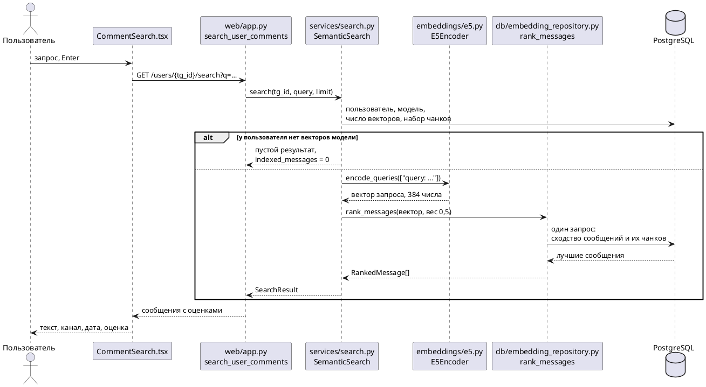

# Поиск по смыслу в комментариях пользователя

Поиск работает поверх готовых эмбеддингов: уровня сообщений и уровня чанков.
Результат — всегда исходные сообщения Telegram. Чанк пользователю не
возвращается: он только добавляет сообщению оценку своего окружения.

```
GET /api/v1/users/{tg_id}/search?q=<запрос>&limit=20&context=true
```

## Как устроен



- **Обработчик** FastAPI проверяет параметры и вызывает сервис; SQL в нём нет.
- **Сервис** находит пользователя, строку модели и набор чанков, получает вектор
  запроса и вызывает один запрос ранжирования.
- **Репозиторий** считает всё в PostgreSQL точным перебором векторов одного
  пользователя. Индекс HNSW не используется.

Поиск идёт только внутри одного пользователя.

## Правило ранжирования

```
score = (1 − w) · message_score + w · chunk_score,   w = 0,5
```

- `message_score` — косинусное сходство вектора сообщения с вектором запроса;
- `chunk_score` — сходство лучшего чанка, в который входит сообщение;
- сообщение, которое ещё не вошло ни в один чанк, оценивается только собой:
  `score = message_score`;
- при равной оценке раньше идёт сообщение с меньшим идентификатором.

Это ранжирование «context» из
[embedding-chunking-research.md](embedding-chunking-research.md), перенесённое без
изменений: та же формула, тот же вес, тот же выбор лучшего чанка.

Параметры, зафиксированные в `services/search.py`:

| Параметр | Значение | Откуда |
|---|---|---|
| `CONTEXT_WEIGHT` | 0,5 | в замерах использовались равные веса; вес не подбирался |
| `CHUNK_STRATEGY`, `CHUNK_PARAMETERS` | `token_budget`, 256 токенов, внутри канала, без перекрытия | рабочий набор чанков |
| модель | `embeddings.e5.PRODUCTION_MODEL`, `multilingual-e5-small` | та, которой построены векторы |

Модель запроса обязана совпадать с моделью хранимых векторов. Сервис ищет строку
`embedding_models` по имени, ревизии, способу объединения и префиксу своего
кодировщика; если такой строки или векторов пользователя нет, поиск возвращает
пустой список и не загружает модель. Запрос кодируется с префиксом `query: `,
хранимые тексты — с `passage: `.

Параметр `context=false` отключает вклад чанков: это обычный поиск по
сообщениям, с которым сравнивается основной.

## Совпадение с замерами

Рабочий поиск сравнен с ранжированием из скрипта замеров на той же модели и тех
же 22 запросах:

| | MRR | R@5 | R@10 |
|---|---|---|---|
| только сообщения, скрипт замеров | 0,852 | 0,048 | 0,082 |
| только сообщения, рабочий поиск | 0,852 | 0,048 | 0,082 |
| с учётом чанков, скрипт замеров | 0,875 | 0,055 | 0,092 |
| с учётом чанков, рабочий поиск | 0,875 | 0,055 | 0,092 |

Первая десятка совпала по составу и порядку во всех 22 запросах.

Прирост от чанков на рабочей модели меньше, чем был на `multilingual-e5-base` в
отчёте о нарезке (там MRR 0,81 → 0,89): 0,852 → 0,875. Обе разницы посчитаны на
22 запросах и лежат в пределах шума, показанного в сравнении моделей.

## Что видно на реальных запросах

Тексты комментариев в репозиторий не попадают, поэтому результаты описаны.

| Запрос | Только сообщения | С учётом чанков |
|---|---|---|
| отношение к трудовым мигрантам | все восемь первых — высказывания по теме | то же, семь из восьми общих; короткое уточнение из трёх слов ушло с первого места на четвёртое |
| имя публициста | восемь упоминаний имени | восемь упоминаний, общих три: вперёд вышли сообщения из разговоров, целиком посвящённых этому человеку |
| поездка на море и отпуск | два сообщения про отпуск, остальное случайное: одиночные слова и фразы с «море» | появились сообщения про купание и отдых без слов из запроса; случайных стало меньше |
| выход стран из альянса в случае войны | новостные сообщения с названием альянса | на третьем месте — собственное высказывание пользователя ровно об этом, которого в первой восьмёрке не было |

Чанк помогает сообщению по теме, в котором нет слов запроса, и убирает случайные
совпадения по одному слову.

### Короткие реплики

Проверены десять вручную подобранных реплик короче десяти токенов, те же, что в
сравнении моделей. Место реплики среди сообщений пользователя:

| Случай | Только сообщение | С учётом чанка |
|---|---|---|
| «именно», профиль с развёрнутыми сообщениями | 385 из 8 936 | 7 |
| «да» в разговоре о троцкизме | 11 639 из 24 076 | 284 |
| «бред» в разговоре об альянсе | 11 688 | 640 |
| «согласен» в разговоре о троллях | 22 108 | 1 773 |
| «да» в разговоре о войне | 10 034 | 2 269 |
| «согласен» в разговоре о Сталине | 10 180 | 4 969 |
| «+» в разговоре об окончании войны | 15 039 | 5 051 |
| слово чатового жаргона | 13 452 | 17 767 |
| короткое самостоятельное высказывание | 4 | 2 |
| короткое самостоятельное высказывание | 13 | 8 |

- Учёт чанка поднимает контекстную реплику в 2–55 раз, но в первую двадцатку она
  попала только в одном случае из восьми.
- Причина в самой формуле. Сходства этой модели лежат в узкой полосе, примерно
  от 0,77 до 0,90. У реплики собственное сходство около 0,78; даже при лучшем
  чанке её итог около 0,81–0,84, а у первых результатов 0,85–0,88.
- В профиле-переписке чанк на 256 токенов состоит из 26–42 реплик на разные
  темы, и его сходство с запросом невелико.

Найти через этот поиск сами реплики «да» и «согласен» по теме разговора нельзя.
Можно найти содержательные сообщения того же разговора. Другой вес или другое
правило могли бы это изменить, но в этой работе ранжирование не подбиралось.

## Скорость

Запрос к приложению целиком, вместе с кодированием запроса на процессоре, в
рабочем образе; 24 запроса на профиль.

| Сообщений у пользователя | С учётом чанков, p50 / p95 | Только сообщения, p50 / p95 |
|---|---|---|
| 24 076 | 221 / 239 мс | 126 / 131 мс |
| 8 936 | 116 / 160 мс | 60 / 62 мс |
| 5 364 | 71 / 76 мс | 45 / 51 мс |
| 1 797 | 42 / 47 мс | 32 / 35 мс |
| 371 | 29 / 34 мс | 31 / 43 мс |

Первый поиск после запуска приложения загружает модель: 10,5 секунды.

Чанк каждого сообщения ищется по индексу для каждого сообщения отдельно
(`LATERAL`). Первая версия запроса соединяла сообщения с агрегатом по всем
чанкам пользователя; планировщик выбирал для неё вложенный цикл без индекса, и
поиск по профилю в 24 тысячи сообщений занимал 11 секунд.

## Интерфейс

На странице пользователя — блок «Поиск по смыслу»: поле, кнопка «Найти», список
результатов с каналом, датой, итоговой оценкой и текстом. Блок показывается, если
у пользователя есть комментарии. Если эмбеддинги построены не для всех
комментариев, блок сообщает, по скольким из них идёт поиск.

## Тесты

- `tests/postgres/test_semantic_search.py` — правило ранжирования, вклад чанка,
  выбор лучшего чанка и нужного набора, вес, поиск в пределах пользователя,
  ограничение числа результатов, сообщение без чанка, отсутствие векторов,
  векторы другой модели, неизвестный пользователь, API.
- `frontend/src/components/CommentSearch.test.tsx` — отправка запроса, список
  результатов, пустой результат, отсутствующие эмбеддинги, ошибка.

## Ограничения и долг

- Поиск по всем пользователям сразу не делался.
- Вес 0,5 не подбирался; контекстные короткие реплики в первые результаты не
  попадают.
- Новые сообщения ищутся только после `python -m scripts.embed --messages`, а
  учитываются с чанком — после `scripts.build_chunks` и `scripts.embed --chunk-set`.
- Модель загружается в процессе веб-приложения при первом поиске и остаётся в
  памяти.
- Сравнение авторов читает те же векторы `message_embeddings`, что и поиск, и
  перед запуском достраивает недостающие для собранных профилей.
